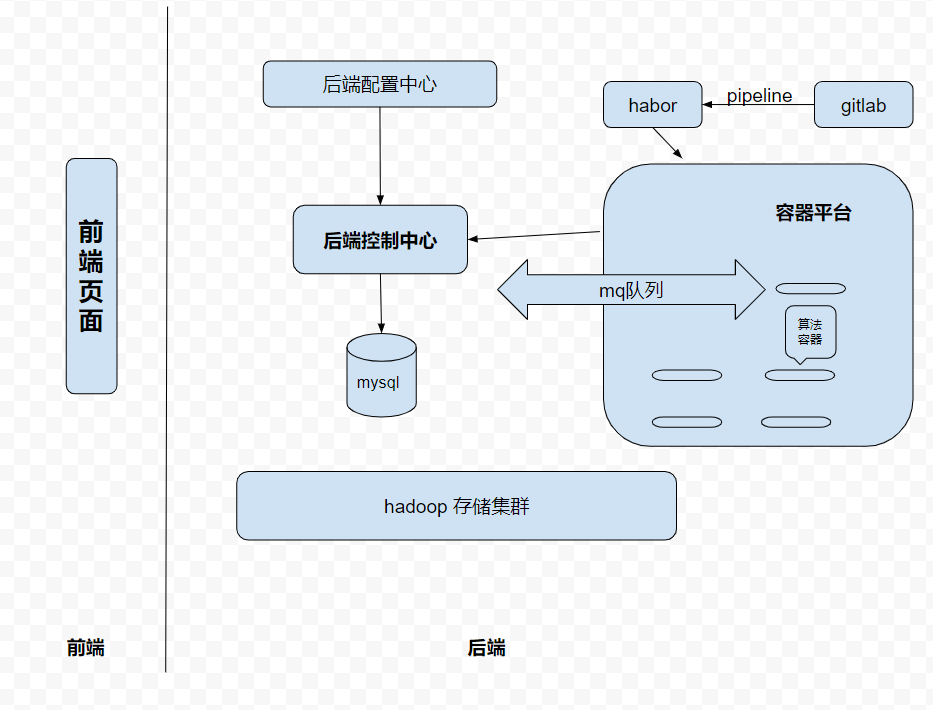

<!-- TOC -->

- [模型训练&发布平台框架设计](#模型训练发布平台框架设计)
    - [overview](#overview)
    - [主干流程](#主干流程)
    - [接口设计](#接口设计)
        - [后端控制中心 和 算法容器 交互](#后端控制中心-和-算法容器-交互)
        - [前端 和 后端控制中心 交互](#前端-和-后端控制中心-交互)
        - [后端控制中心  和 k8s容器平台](#后端控制中心--和-k8s容器平台)
        - [hdfs api接口](#hdfs-api接口)

<!-- /TOC -->
# 模型训练&发布平台框架设计

## overview

* 文档版本更新

version |  更新时间 | 更新内容
--------- | ------- |-----
`draft`| `2019-11-19`|  
`v1`| `2019-12-3` | 框架完善&接口更新

* 系统框架

* 各个组件角色：

1、 前端页面 ： 最终用户操作界面，承接所有的用户需求，下发用户配置数据和操作命令到后端

2、 gitlab & habor ： gitlab作为代码仓库，habor作为docker镜像仓库组成整个系统的CI（持续集成）管道

3、 后端控制中心 ： 生成用户数据集，控制训练任务，管理模型api接口

4、 容器平台： 需要两套容器平台，提供模型训练和api发布的平台

5、 hadoop存储集群：统一图片和模型存储

6、 mysql： 为后端控制中心提供数据持久化

7、 后端配置中心：后端统一配置中心

8、 mq队列： 为后端控制中心和算法程序之间提供通信接口

## 主干流程

* 数据集上传： 用户从前端页面上传数据集--->后端控制中心---> hadoop存储集群
* 模型训练: 用户点击开始训练模型---> 后端控制中心 ---> 容器平台启动训练任务 ---> 容器返回结果至后端控制中心 ---> 后端控制中心收集结果返回页面
* 模型校验： 用户点击校验按钮 ---> 后端控制中心调度校验任务后将结果返回前端页面
* api发布: 用户申请发布api ---> 后端控制中心将模型sdk发布到发布平台

## 接口设计

### 后端控制中心 和 算法容器 交互

* 订阅消息队列top

### 前端 和 后端控制中心 交互

* * http restful 风格接口

* 详细接口列表： http://10.16.32.29:30013/project/30/interface/api

* 用户注册登录管理

|接口名称 | 说明 | 备注|
|:--: | :--: | :--:
|`用户邮箱注册` | 用户管理 |  |
|`用户手机注册` | 用户管理 |  |
|`用户名密码登录` | 用户管理 |  |

* 数据集管理

|接口名称 | 说明 | 备注|
|:--: | :--: | :--:
|`数据集上传` | 数据集管理 |  |
|`数据集查看` | 数据集管理 |  |
|`数据集创建` | 数据集管理 |  |

* AUTOCV训练控制

|接口名称 | 说明 | 备注|
|:--: | :--: | :--:
|`模型列表的创建` | 模型管理 |  |
|`模型列表查看` | 模型管理 |  |
|`添加模型&数据集&下发训练任务` | 模型训练管理 |  |
|`历史使用数据集记录` | 模型训练管理 |  |

* 模型校验

* 模型发布
### 后端控制中心  和 k8s容器平台 
* 参照java sdk https://github.com/kubernetes-client/java/ 

### hdfs api接口

* demo参照：https://princetonits.com/using-filesystem-api-to-read-and-write-data-to-hdfs/

* 官方接口： https://hadoop.apache.org/docs/r2.7.3/api/index.html

