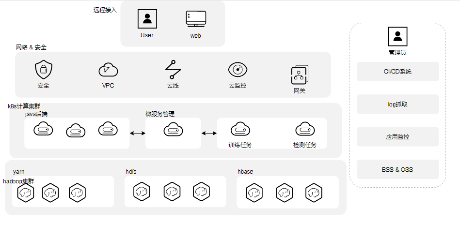
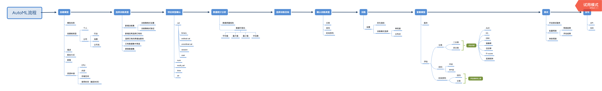

<!-- TOC -->

- [overview](#overview)
- [平台交付部署参考](#平台交付部署参考)
    - [用户视图及简要说明](#用户视图及简要说明)
    - [用户环境对接参考](#用户环境对接参考)
- [子系统功能定义](#子系统功能定义)
    - [WEB操作页面](#web操作页面)
- [授权](#授权)
    - [标注平台](#标注平台)
    - [训练平台](#训练平台)
    - [AI开放平台](#ai开放平台)
- [平台部署安装](#平台部署安装)

<!-- /TOC -->
## overview
* 需求定义： 参照产品设计文档

## 平台交付部署参考

### 用户视图及简要说明

* SAAS层提供SAAS级别的云服务，用户通过SAAS的页面来操作平台
* PAAS的其他组件和SAAS层需要本司(深兰北京)交付
* IAAS 层资源需要用户方完整提供

### 用户环境对接参考

* 物理视图

## 子系统功能定义
* 系统架构略图

### WEB操作页面
*  end users和系统应用的交互系统

* autocv的用户操作视图示例

* automl的用户操作视图示例

## 授权

### 标注平台
* 待定
### 训练平台
* 待定
### AI开放平台
* 一般意义按照用户调用接口次数收费，具体参照产品文档。

## 平台部署安装

参照《AI平台对接iaas层交付部署.pdf》

