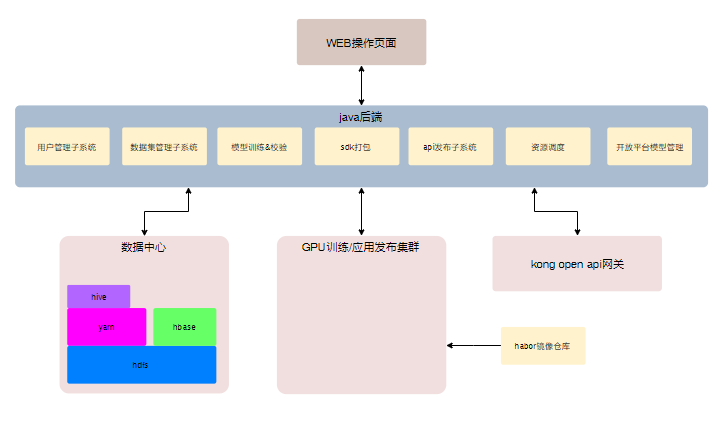

## overview

* 需求定义： AI平台设计文档
* 系统架构略图



## 系统分解

### paas平台

* 调度器定制化部署

    1）nvidia默认调度器部署
    ```shell
        kubectl apply -f nvidia-device-plugin.yml
    ```
    note： 需要提前再需要调度的nvidia机器上打上标签：
    
        kubectl label nodes 10.2.2.123 gpushare=false


    2）gpu共享调度器部署


    note： 需要提前再需要调度的nvidia机器上打上标签：
    
        kubectl label nodes 10.2.2.123 gpushare=true
    
        1. 替换 scheduler-policy-config.json kube-scheduler.yaml 两个文件
        2. Install ali scheduler ： https://github.com/AliyunContainerService/gpushare-scheduler-extender/blob/master/docs/install.md
        3. Install ali device plugin： https://github.com/AliyunContainerService/gpushare-scheduler-extender/blob/master/docs/install.md


### hadoop数据中心

* 安装脚本： http://203.195.212.206/hadoop/hadoop_install.sh

* 存储hdfs

    启动namenode： ${HADOOP_HOME}/sbin/hadoop-daemon.sh start namenode

    启动datanode   ${HADOOP_HOME}/sbin/hadoop-daemon.sh start datanode

* 存储hbase

    一键启动脚本  ${HBASE_HOME}/bin/start-hbase.sh


    ### open api 网关

* kong 
1. download rpm package
    https://docs.konghq.com/install/centos/
2. Install rpm package

```shell
 $  sudo yum install epel-release
 $  sudo yum install kong-2.0.3.*.noarch.rpm --nogpgcheck

```
3. create your dabase for your kong

```shell
    CREATE USER kong; CREATE DATABASE kong OWNER kong;

    $ kong migrations bootstrap [-c /path/to/kong.conf]
```

4. start your kong gateway

```shell
    kong start [-c /path/to/kong.conf]
```


* ui dashboard

    可选项

### java后端

## 1.rancher配置

### 1.添加项目

#### 1.ai-platform（命名空间：aiopenservice）

##### 1.agricultureappleservice（苹果病虫害检测服务）

镜像名称：core.harbor.cz.shenlan.com/aiplatform-online/ubuntu16.04-apple-diseases-prod:v1

资源限制：aliyun.com/gpu-mem: "2"

##### 2.agriculturepotatoservice（马铃薯病虫害检测服务）

镜像名称：core.harbor.cz.shenlan.com/aiplatform-online/ubuntu16.04-potato-diseases-prod:v1

资源限制：aliyun.com/gpu-mem: "2"

##### 3.capcheckservice（安全帽检测服务）

镜像名称：core.harbor.cz.shenlan.com/aiplatform-online/nvidia-cuda10.0.ai_helm-runtime-prod:v1

资源限制：aliyun.com/gpu-mem: "2"

##### 4.maskcheckservice（口罩识别服务）

镜像名称：core.harbor.cz.shenlan.com/aiplatform-online/mask-check-prod:v1

资源限制：aliyun.com/gpu-mem: "2"

##### 5.reidservice（人员追踪服务）

镜像名称：core.harbor.cz.shenlan.com/nvidia/nvidia-cuda10.0.reid-runtime-prod:v1

资源限制：aliyun.com/gpu-mem: "2"

##### 6.vehicleservice（车辆管理服务）

镜像名称：core.harbor.cz.shenlan.com/aiplatform-online/license-plate-runtime-prod:v1

资源限制：GPU两块

##### 7.roadservice（路政服务）

镜像名称：core.harbor.cz.shenlan.com/aiplatform-online/road-admin-prod:v1

资源限制：aliyun.com/gpu-mem: "2"

#### 2.autocv（命名空间：autocv）

描述：用来归档所有autocv分类项目的训练，校验，发布的镜像容器

#### 3.autodetect（命名空间：autodetect）

描述：用来归档所有autodetect分类项目的训练，校验，发布的镜像容器

#### 4.automl（命名空间：automl）

描述：用来归档所有autodetect分类项目的训练，校验，发布的镜像容器

#### 5.autonlp（命名空间：autonlp）

描述：用来归档所有autonlp分类项目的训练，校验，发布的镜像容器

#### 6.production

1.consul集群：

（1）工作负载：consul-server

​	镜像名称：core.harbor.cz.shenlan.com/deepblue-springcloud/consul:1.5.0

​	环境变量：CONSUL_BIND_INTERFACE = eth0

​	端口映射：8500  30014

​					    8301 30015

​	主机调度：需要主机调度到指定一台

​	数据卷：

​			容器路径：/consul/config

​			容器路径：/consul/data

​	命令CMD：consul agent --data-dir=/consul/data --node=node1 --server=true --bootstrap-expect=1 --client=0.0.0.0 -ui

（2）工作负载：consul-server2

​	镜像名称：core.harbor.cz.shenlan.com/deepblue-springcloud/consul:1.5.0

​	环境变量：CONSUL_BIND_INTERFACE = eth0

​	主机调度：需要主机调度到指定一台

​	数据卷：

​			容器路径：/consul/config

​			容器路径：/consul/data

​	命令：consul agent --data-dir=/consul/data --node=node2 --server=true --client=0.0.0.0 --join XX.XX.XX.XX:30015(地址：consul-server ip地址)

（3）工作负载：consul-server3

​	镜像名称：core.harbor.cz.shenlan.com/deepblue-springcloud/consul:1.5.0

​	环境变量：CONSUL_BIND_INTERFACE = eth0

​	主机调度：需要主机调度到指定一台

​	数据卷：

​			容器路径：/consul/config

​			容器路径：/consul/data

​	命令：consul agent --data-dir=/consul/data --node=node3 --server=true --client=0.0.0.0 --join XX.XX.XX.XX:30015(地址：consul-server ip地址)

2.aicontrol（控制台微服务）

镜像名：harbor-cz.deepblueai.com/springcloud/aicontrol:0.1.0.0 

环境变量：

spring.redis.model = cluster(single为单机版，cluster集群)

spring.profiles.active = prod

3.aiplatform（autocv分类微服务）

镜像名：harbor-cz.deepblueai.com/springcloud/aiplatform:0.1.0.0

环境变量：

spring.redis.model = cluster(single为单机版，cluster集群)

spring.profiles.active = prod

4.aiplatform-web（ai开发平台微服务）

镜像名：harbor-cz.deepblueai.com/springcloud/aiplatform:0.1.0.0

环境变量：

spring.redis.model = cluster(single为单机版，cluster集群)

spring.profiles.active = prod

5.auth（认证平台微服务）

镜像名：harbor-cz.deepblueai.com/springcloud/authentication:0.1.0.0

环境变量：

spring.redis.model = cluster(single为单机版，cluster集群)

spring.profiles.active = prod

6.autodetect（autocv检测平台微服务）

镜像名：harbor-cz.deepblueai.com/springcloud/autodetect:0.1.0.0

环境变量：

spring.redis.model = cluster(single为单机版，cluster集群)

spring.profiles.active = prod

网络（需要配置hosts）：

example：

| 10.16.34.207 |      | hadoop-node1.local |      |      |
| ------------ | ---- | ------------------ | ---- | ---- |
| 10.16.32.243 |      | hadoop-node2.local |      |      |
| 10.16.33.183 |      | hadoop-node3.local |      |      |
| 10.16.34.97  |      | hadoop-node4.local |      |      |
| 10.16.34.96  |      | hadoop-node5.local |      |      |

7.automl（automl微服务）

镜像名：harbor-cz.deepblueai.com/springcloud/automl:0.1.0.0

环境变量：

spring.redis.model = cluster(single为单机版，cluster集群)

spring.profiles.active = prod

网络（需要配置hosts）：

example：

| 10.16.34.207 |      | hadoop-node1.local |      |      |
| ------------ | ---- | ------------------ | ---- | ---- |
| 10.16.32.243 |      | hadoop-node2.local |      |      |
| 10.16.33.183 |      | hadoop-node3.local |      |      |
| 10.16.34.97  |      | hadoop-node4.local |      |      |
| 10.16.34.96  |      | hadoop-node5.local |      |      |

8.autonlp（autonlp微服务）

镜像名：harbor-cz.deepblueai.com/springcloud/autonlp:0.1.0.0

环境变量：

spring.redis.model = cluster(single为单机版，cluster集群)

spring.profiles.active = prod

网络（需要配置hosts）：

example：

| 10.16.34.207 |      | hadoop-node1.local |      |      |
| ------------ | ---- | ------------------ | ---- | ---- |
| 10.16.32.243 |      | hadoop-node2.local |      |      |
| 10.16.33.183 |      | hadoop-node3.local |      |      |
| 10.16.34.97  |      | hadoop-node4.local |      |      |
| 10.16.34.96  |      | hadoop-node5.local |      |      |

9.gateway（gateway网关微服务）

镜像名：harbor-cz.deepblueai.com/springcloud/gateway:0.1.0.0

环境变量：

spring.redis.model = cluster(single为单机版，cluster集群)

spring.profiles.active = prod

端口映射：8080 --->30082

主机调度：指定一台服务器

10.hbase（hbase微服务）

镜像名：harbor-cz.deepblueai.com/springcloud/hbase:0.1.0.0

环境变量：

spring.profiles.active = prod

网络（需要配置hosts）：

example：

| 10.16.34.207 |      | hadoop-node1.local |      |      |
| ------------ | ---- | ------------------ | ---- | ---- |
| 10.16.32.243 |      | hadoop-node2.local |      |      |
| 10.16.33.183 |      | hadoop-node3.local |      |      |
| 10.16.34.97  |      | hadoop-node4.local |      |      |
| 10.16.34.96  |      | hadoop-node5.local |      |      |

11.hdfs-http-proxy（hdfs资源微服务）

镜像名：harbor-cz.deepblueai.com/springcloud/hdfs-http-proxy:0.1.0.0

环境变量：

spring.profiles.active = prod

12.kongclient（kong客户端api调用微服务）

镜像名：harbor-cz.deepblueai.com/springcloud/kongclient:0.1.0.0

环境变量：

spring.profiles.active = prod

13.kubernetes（调用k8s的api服务）

镜像名：harbor-cz.deepblueai.com/springcloud/kubernetes:0.1.0.0

环境变量：

spring.profiles.active = prod

14.xxl-job（xxl-job服务）

镜像名：harbor-cz.deepblueai.com/springcloud/xxl-job-admin:2.1.0.RELEASE

环境变量：

spring.profiles.active = prod

容器端口：

8848 --->30048

## 2.hdfs资源数据迁移

### 1.autocv分类项目

（1）window离线包根目录：/data/autocv/user/root/sdkTemplate

（2）linux离线包根目录：/data/autocv/user/root/sdkTemplateLinux

（3）算法资源：/model/AutoCV

### 2.automl项目

 （1）windows离线包：/data/automl/user/root/sdk/template/win10/automl_sdk

 （2）linux离线包：/data/automl/user/root/sdk/template/linux/automl_sdk

### 3.autodetect检测平台

   （1）windows离线包：/data/autodetect/user/root/sdkWin64/SDK_API

   （2）linux离线包：/data/autodetect/user/root/sdkLinux/SDK_API

### 4.ai开放平台

   （1）开放能力资源包地址：/data/aiplatformweb/user/root/ability

   （2）banner图地址：/data/aiplatformweb/user/root/banner

   （3）客户案例资源地址：/data/aiplatformweb/user/root/customercase

   （4）合作伙伴资源地址：/data/aiplatformweb/user/root/partner

   （5）应用案例使用场景资源地址：/data/aiplatformweb/user/root/scene

   （6）解决方案资源地址：/data/aiplatformweb/user/root/solution

   （7）车辆识别以图搜图资源配置：/data/aiplatformweb/user/root/imagesearch/storage

   （8）车辆识别以图搜图图库地址配置：/data/aiplatformweb/user/root/zip/imagesearch

   （9）reid案例example资源地址：/data/aiplatformweb/user/root/reid/example

