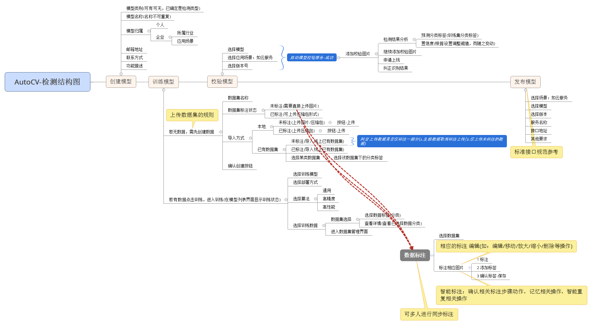
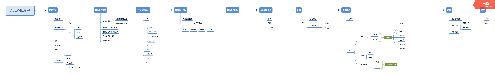
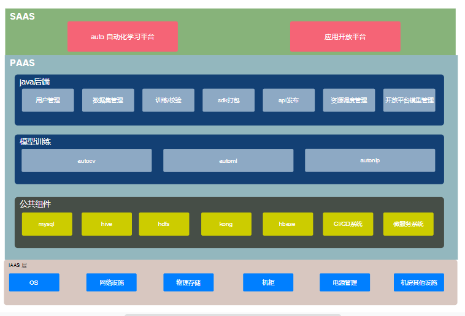
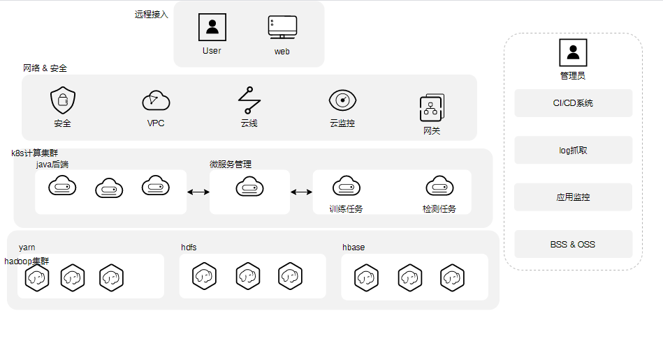

<!-- TOC -->

- [overview](#overview)
- [子系统功能定义](#子系统功能定义)
    - [WEB操作页面](#web操作页面)
    - [java后端](#java后端)
    - [数据中心](#数据中心)
    - [GPU训练&发布集群](#gpu训练发布集群)
    - [kong openapi 网关](#kong-openapi-网关)
    - [habor镜像仓库](#habor镜像仓库)
- [业务流程处理](#业务流程处理)
    - [注册登录](#注册登录)
    - [autocv](#autocv)
    - [automl](#automl)
    - [autonlp](#autonlp)
- [平台交付部署参考](#平台交付部署参考)
    - [用户视图及简要说明](#用户视图及简要说明)
    - [用户环境对接参考](#用户环境对接参考)

<!-- /TOC -->

## overview
* 需求定义： 参照产品设计文档
* 系统架构略图

## 子系统功能定义

### WEB操作页面
*  end users和系统应用的交互系统

* autocv的用户操作视图

* automl的用户操作视图

### java后端

* 用户管理子系统

|子功能 | 说明 | 备注|
|:--: | :--: | :--:
|`用户邮箱注册` | 用户管理 |  |
|`用户手机注册` | 用户管理 |  |
|`用户名密码登录` | 用户管理 |  |
|`用户权限管理` | 用户管理 |  |

* 数据集管理

|子功能 | 说明 | 备注|
|:--: | :--: | :--:
|`增加` | 数据集管理 |  |
|`删除` | 数据集管理 |  |
|`查询` | 数据集管理 |  |
|`改动` | 数据集管理 |  |

* 模型训练&校验

|子功能 | 说明 | 备注|
|:--: | :--: | :--:
|`训练任务创建` | 模型训练 |  |
|`训练任务中断` | 模型训练 |  |
|`训练结果生成&保存` | 模型训练 |  |
|`模型校验任务创建` | 模型校验 |  |
|`模型校验任务删除` | 模型校验 |  |

* sdk离线打包

|子功能 | 说明 | 备注|
|:--: | :--: | :--:
|`win sdk 离线包` | sdk离线打包 |  |
|`linux sdk 离线包` | sdk离线打包 |  |

* api发布子系统

|子功能 | 说明 | 备注|
|:--: | :--: | :--:
|`api注册` | 向kong gw 注册api |  |
|`api 删除` | 删除失效的api |  |
|`api 查询` | 查询用户的api |  |
|`api 权限管理` | 生成及保存api的权限 |  |
|`api 调用次数统计` | 统计调用次数 |  |

* 资源调度

|子功能 | 说明 | 备注|
|:--: | :--: | :--:
|`训练任务资源的评估及调度` | 根据训练任务的需求评估大约的资源使用情况，然后调度到相应的物理节点甚至制定的gpu上 |  |

* 开发平台模型管理

|子功能 | 说明 | 备注|
|:--: | :--: | :--:
|`接入应用开放平台的模型` | 管理应用开放平台的模型应用|  |

### 数据中心

* hdfs 统一物理存储集群
* yarn 批量数据计算处理集群
* hive 为hdfs抽象出sql操作接口，仅支持离线访问
* hbase 为java后端提供在线查询服务

### GPU训练&发布集群
该集群主体是kubernetes容器集群，为模型训练和检测提供cpu，gpu，memory，网络等资源或服务。调度器为gpu做过定制化。

### kong openapi 网关

该网关用于注册模型检测的api，开发者访问该api获取到样本的检测值

### habor镜像仓库
这是一个容器镜像仓库，主要存储模型训练代码的docker 镜像和模型检测代码docker镜像

## 业务流程处理

### 注册登录

### autocv

### automl

### autonlp

## 平台交付部署参考

### 用户视图及简要说明

* 图示每个模块之间已经实现松耦合，及模块之间通过标准接口相互访问。
* 公共组件  和  k8s容器平台  由用户&厂商&第三方都可以提供
* IAAS 层资源需要用户方完整提供
* PAAS的其他组件和SAAS层需要本司交付

|组件名称 | 是否可以复用用户提供的组件 | 备注|
|:--: | :--: | :--:
|`mysql` | Y |  |
|`hive` | Y |  |
|`hdfs` | Y |  |
|`hbase` | Y |  |
|`kubernetes` | Y |  |
|`CI/CD` | Y |  |

### 用户环境对接参考

* 物理视图

