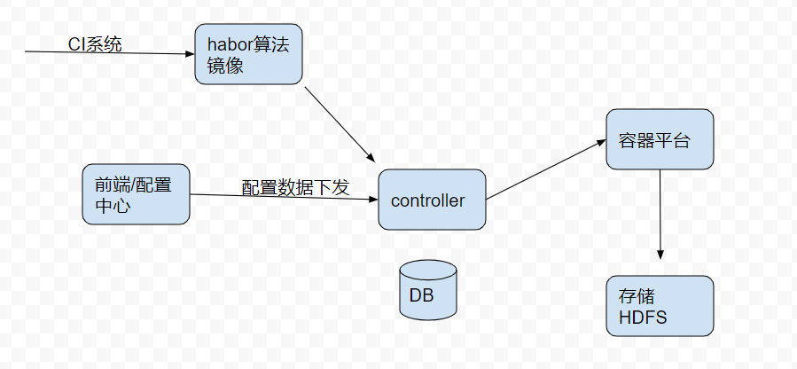
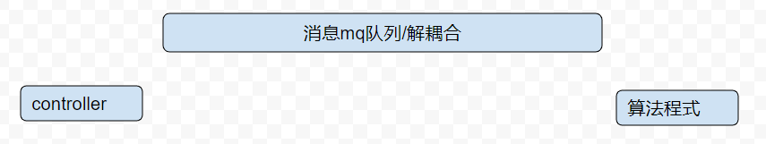

# 算法平台流程设计（draft）

## overview

* 系统框架

* * CI系统 ： 目的是通过docker build 生成docker 镜像存储在habor上
* * 前端 ： 最终用户操作界面，下发用户配置数据和操作命令
* * controller ： 生成算法容器，和前端对接，和容器云平台对接
* * 容器平台： 提供算法的资源调度平台
* * HDFS：统一图片和模型存储
* * DB： 为controller提供配置持久化

## 主干流程

* 前置流程： 需要预先将算法的python程序打成docker image推送到habor仓库
* A阶段 前端由用户配置数据，并且将数据更新至controller
* B阶段 controller根据配置数据和habor镜像，调用k8s的接口创建容器，开始跑算法程式
* C阶段 算法容器需要和controller交互（需要定制接口），如果成功完成训练，则返回给前端，通知用户。

## 接口设计

### controller <------> 算法容器

* * 训练结果回传jason文件

* * 向算法传递数据集

controller 生成数据集列表（json格式）

### 前端 <------> controller

* * http restful 风格接口

接口列表

* 用户注册登录管理

|接口名称 | 说明 | 备注|
|:--: | :--: | :--:
|`用户邮箱注册` | 用户管理 |  |
|`用户手机注册` | 用户管理 |  |
|`用户名密码登录` | 用户管理 |  |

* 数据集管理

|接口名称 | 说明 | 备注|
|:--: | :--: | :--:
|`数据集上传` | 数据集管理 |  |
|`数据集查看` | 数据集管理 |  |
|`数据集创建` | 数据集管理 |  |

* AUTOCV训练控制

|接口名称 | 说明 | 备注|
|:--: | :--: | :--:
|`模型列表的创建` | 模型管理 |  |
|`模型列表查看` | 模型管理 |  |
|`添加模型&数据集&下发训练任务` | 模型训练管理 |  |
|`历史使用数据集记录` | 模型训练管理 |  |

* 模型校验

* 模型发布
### controller  <------> k8s容器平台
参照java sdk https://github.com/kubernetes-client/java/ 

### hdfs api接口

demo参照 https://princetonits.com/using-filesystem-api-to-read-and-write-data-to-hdfs/

