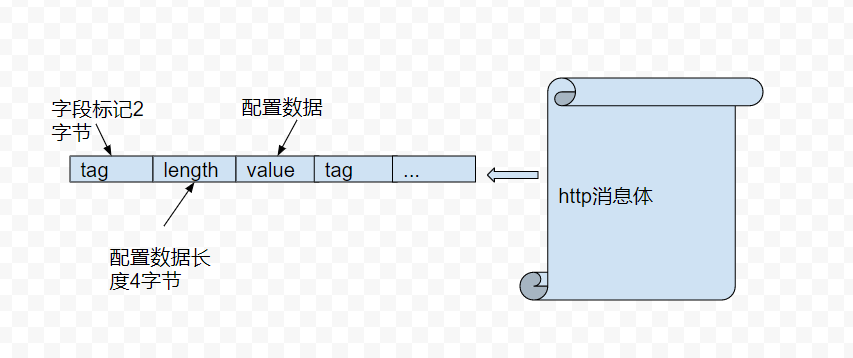

# 算法平台流程设计（draft）

## overview

* 系统框架

* * CI系统 ： 目的是通过docker build 生成docker 镜像存储在habor上
* * 前端 ： 最终用户操作界面，下发用户配置数据和操作命令
* * controller ： 生成算法容器，和前端对接，和容器云平台对接
* * 容器平台： 提供算法的资源调度平台
* * HDFS：统一图片和模型存储
* * DB： 为controller提供配置持久化

## 主干流程

* 前置流程： 需要预先将算法的python程序打成docker image推送到habor仓库
* A阶段 前端由用户配置数据，并且将数据更新至controller
* B阶段 controller根据配置数据和habor镜像，调用k8s的接口创建容器，开始跑算法程式
* C阶段 算法容器需要和controller交互（需要定制接口），如果成功完成训练，则返回给前端，通知用户。

## 接口设计

* controller <------> 算法容器

* 前端 <------> controller

* * http restful 风格接口

