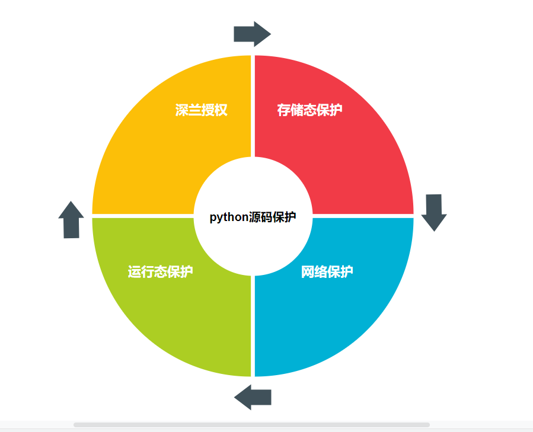

# python 算法代码保护

## overview
* 运行平台： kubernetes
* 存储形式： harbor仓库
* 保护阶段： 运行时保护，存储保护，网络保护
* 授权形式： 绑定硬件，授权期限（待实现）



## 保护方法
* 禁用容器shell
* pyarmor加密python源码

## Usage

* 1. pip install pyarmor==6.2.8

* 2. pyarmor init --entry={YOUR ENTRY SCRIPT} .

* 3. pyarmor build

* 4. copy your release version from dist dir


## 性能影响
* 样例输出结论

```shell
INFO     Start benchmark test ...
INFO     Obfuscate module mode: 1
INFO     Obfuscate code mode: 1
INFO     Obfuscate wrap mode: 1
INFO     Benchmark bootstrap ...
INFO     Benchmark bootstrap OK.
INFO     Run benchmark test ...
Test script: bfoo.py
Obfuscated script: obfoo.py
--------------------------------------

load_pytransform: 28.429590911694085 ms
init_pytransform: 10.701080723946758 ms
verify_license: 0.515428636879825 ms
total_extra_init_time: 40.34842417122847 ms

import_no_obfuscated_module: 9.601499631936461 ms
import_obfuscated_module: 6.858413569322354 ms

re_import_no_obfuscated_module: 0.007263492985840059 ms
re_import_obfuscated_module: 0.0058666674116400475 ms

run_empty_no_obfuscated_code_object: 0.015085716201360122 ms
run_empty_obfuscated_code_object: 0.0058666674116400475 ms

run_one_thousand_no_obfuscated_bytecode: 0.003911111607760032 ms
run_one_thousand_obfuscated_bytecode: 0.005307937181960043 ms

run_ten_thousand_no_obfuscated_bytecode: 0.003911111607760032 ms
run_ten_thousand_obfuscated_bytecode: 0.005587302296800045 ms

--------------------------------------
INFO     Remove test path: .\.benchtest
INFO     Finish benchmark test.
```

其中额外的初始化时间大约是 40ms ，这包括装载动态库、初始化动态库和校 验授权文件的总时间。

上面结果中，导入加密模块的时间还少于导入正常模块的时间，这主要是因为加 密脚本已经被编译成为字节码文件，而原始文件需要额外的时间来进行编译。

这里执行加密函数需要的额外时间一般在 0.002ms 左右，也就是执行 1000 个函数，加密脚本额外消耗的时间大约为 2ms 。

不同的机器可能结果不同，需要根据实际环境下运行结果来进行评估。


## CI/CD集成
* 将python的发布集成进入cicd系统，以下是一个已经实现的demo
```dockerfile
###################################
# algo release  app  by dockerfile
#  @ 2020/6/23
#  @Copyright Deepblue. Beijing. AI

# stage 1: encrypt your python code with pypyarmor
FROM ccr.ccs.tencentyun.com/deepblue/python-encrypt:builder as builder
COPY CenterNet_release /app/code

RUN cd /app/code && \
        pyarmor init --entry=inference_api.py . && \
        pyarmor build

# stage 2: release docker image 
FROM ccr.ccs.tencentyun.com/deepblue/pytorch:1.2
MAINTAINER  wangdf <wangdf@deepblueai.com>

RUN apt-get update && \
    apt-get install -y --no-install-recommends sudo && \
    apt-get install -y libgl1-mesa-glx &&\
    rm -rf /var/lib/apt/lists/*

COPY .condarc /root
RUN conda install -y opencv=4.2.0 && \
    conda install -y hdfs3 -c conda-forge && \
    pip install --no-cache-dir numpy==1.18.1 flask filterpy

# Install dcnv2 pkg

COPY DCNv2 /app/DCNv2
RUN cd /app/DCNv2 && bash make.sh

COPY --from=builder /app/code/dist /app/CenterNet_release

COPY CenterNet_release/weights /app/CenterNet_release/weights


# 将容器的shell禁用掉
RUN usermod -s /usr/sbin/nologin root  && rm -r /bin/sh /bin/bash /bin/rbash /bin/dash
# run  app
ENTRYPOINT ["python", "/app/CenterNet_release/inference_api.py"]
```